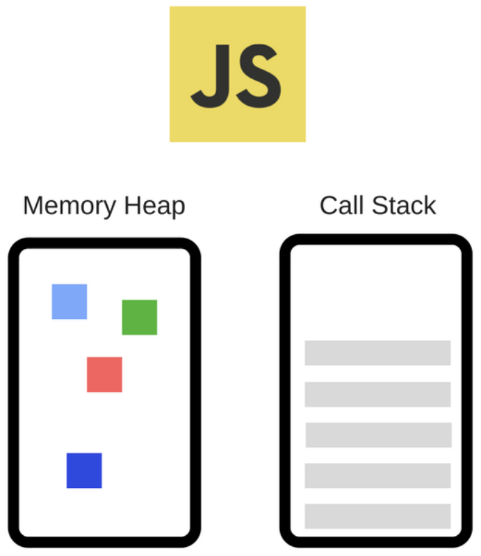
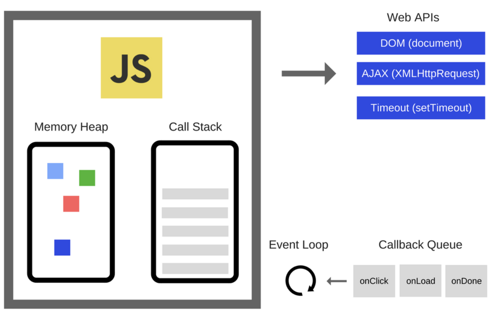
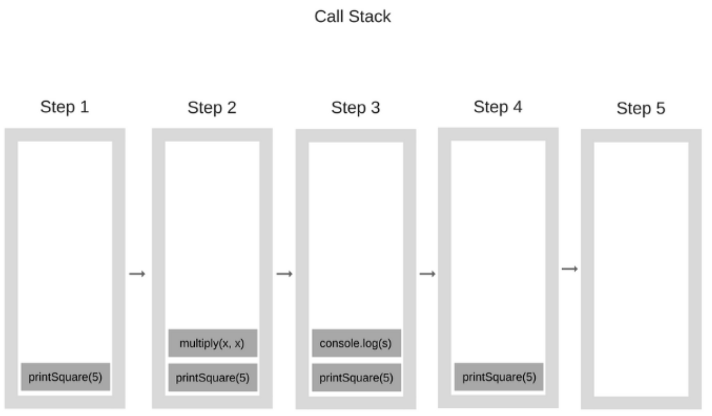
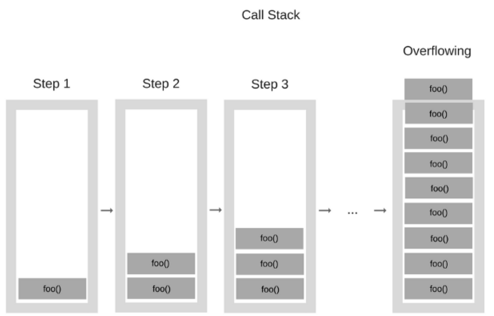
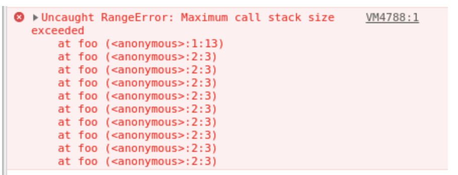
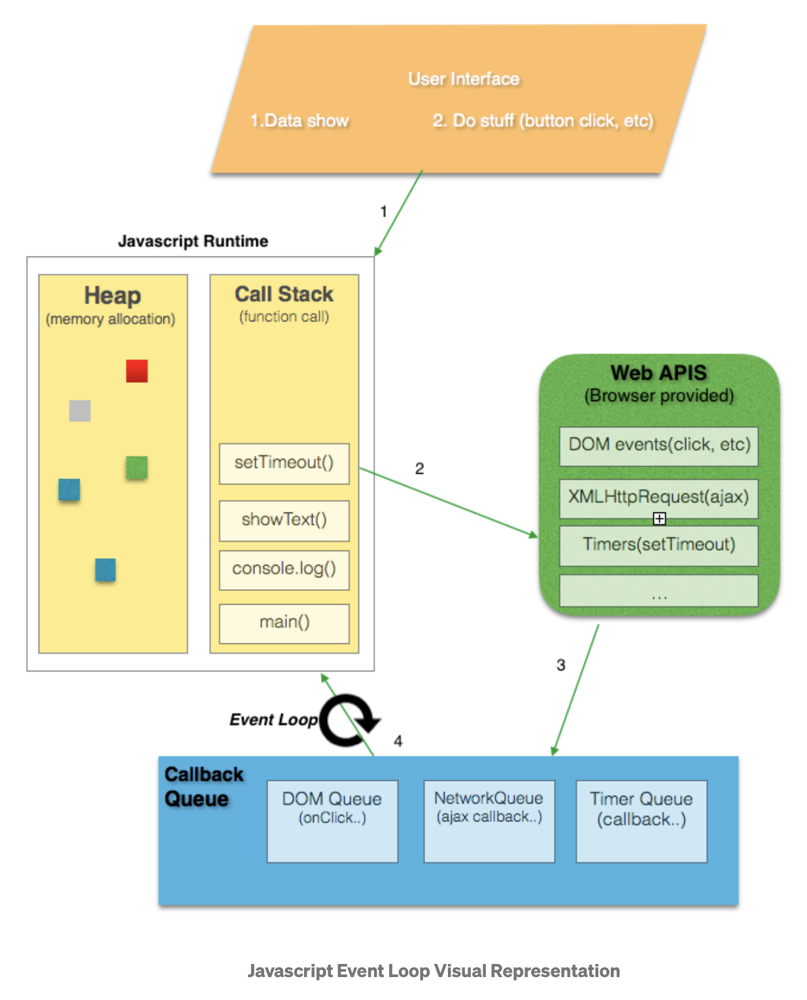

Hola Bienvenide, en esta ocación aprenderas sobre:
- JavaScript
- Call Stack
- Memory Heap
- Web API`s
- Callback & Promises Queue
- Evento Loop

Comencemos por el principio...

# 1. ¿Qué es JavaScript?
Comencemos entendiendo qué Javascript es:
- Un **lenguaje de programación concurrente** de un **solo hilo**, lo que significa que puede manejar una tarea a la vez o un fragmento de código a la vez.
- **Asincrono y no bloqueante**, lo que significa que puede delegar tareas al navegador o a Node.js sin perder el control de ejecución del programa.

## 1.1¿Qué elementos componen a JavaScript?

### 1.1.1 El Motor de JavaScript V8 

El [Motor de JavaScript V8](https://dev.to/bipinrajbhar/how-javascript-works-under-the-hood-an-overview-of-javascript-engine-heap-and-call-stack-1j5o) es concurrente y de un solo hijo, se usa dentro de Chrome y Node.js, ejecuta una cosa a la vez y esta compuesto por:
1. Una sola pila de llamada/Call Stack (Orden de ejecucion)
2. El montón de memoria/Memory heap(Lugar de almacenamiento de los datos)

Visualmente se podría decir que lucen así:



### 1.1.2 El Tiempo de ejecución 

El [Módelo asincono y no bloqueante](https://dev.to/bipinrajbhar/how-javascript-works-web-apis-callback-queue-and-event-loop-2p3e) esta compuesto por:
1. El ciclo de eventos/Event Loop
2. Las Web API`s
3. La Cola/The Queue

Visualmente se podría decir que lucen así:


# 2.¿Qué es el Call Stack?
Es una estructura de datos que registra **Marcos de pila - Stack Frame** que contienen:
- La función
- El contexto de ejecuión
- El nombre del archivo al cual pertenece
- El número de la siguiente linea a ejecutar que se ira actualizando con el tiempo.

## 1.2. ¿Para qué se crea el Call Stack?

Se crea para hacerle seguimiento a las llamadas de las funciones, básicamente en qué parte del programa nos encontramos.

Una llamada se refiere a la invocación de un método o función.

## 1.2.¿Cómo funciona el Call Stack?
>Una estructura de pila, es aquella que tiene la característica, que el elemento que ingresa primero, sale de ultimo. Se van apilando uno encima de otro.

En JavaScript el Call Stack realiza un proceso simple, cuando se hace un llamado a una función, se añade un registro al stack que contiene:
- La función
- El contexto de ejecuión
- El nombre del archivo al cual pertenece
- El número de la siguiente linea a ejecutar que se ira actualizando con el tiempo.

Si dicha función llama a su vez a otra función, es agregada sobre la anterior.

Por ejemplo:

```js
// Definimos un par de funciones
function multiply(x, y) {
    return x * y;
}
function printSquare(x) {
    var s = multiply(x, x);
    console.log(s);
}
printSquare(5);
```

Así sería el orden:
- Se añade la invocación de `calcularPotencia()`.
- `calcularPotencia()` invoca a la función `multiplicar()`, por lo que esta se añade a la pila.
- Se ejecuta la función `multiplicar()`, por lo que sale de la pila.
- Se añade a la pila el `console.log()` invocado en `calcularPotencia()`.
- Se ejecuta el `console.log()`, por lo que sale de la pila.
- Se finaliza la ejecución de `calcularPotencia()`, por lo que sale de la pila.
- La pila se vacía.

Así se vería graficamente:


## 1.3¿Qué sucede si se llena Call Stack?


Lo que sucedería es que el navegador detiene la ejecución y muestra el siguiente error:


# 2.¿Qué es el Memory Heap?

Es el espacio del navegador donde se almacenan los datos y valores de las variables y funciones.

El memory heap se guarda en la RAM, y esta es una memoria volátil (Es decir, no puede preservar la información una vez el computador se apaga)
Por lo que, si se cierra el navegador o se apaga el computador, lo que haya estado en el memory heap se pierde.

## 2.1.¿Cómo funciona el Memory Heap?

La información en el memory heap se guarda de forma arbitraria y sin un orden, los cuales pueden ser usados múltiples veces y sin una referencia unica. 

# 3.¿Qué es el Call Back Queue?
La cola de devolución de llamada es una estructura de datos **FIFO - First In First Out**.

# 3.1.¿Cómo funciona el Call Back Queue?
**La cola de devolución de llamada - Call Back Queue** almacena todas las funciones de devolución de llamada en el orden en que se agregan.

# 4.¿Qué es Event Loop?

- Es un elemento importante para el asincronismo en JavaScript
- Es un constante escuchador del Call Back Queue y del Call Stack.

# 4.1.¿Cómo funciona el Event Loop?

Tiene tres funciones principales:
1. Pregunta de manera constante al Call Back Queue si ya tiene un valor retornado desde una API Web.
2. Pregunta de manera constante al Call Stack si ya esta libre de tareas.
3. Solamente si el Call Stack se encuentra libre de tareas, es cuando el Event Loop mueve una tarea/Valor desde el Call Back Queue hacia el Call Stack para ser ejecutada.

# 5.¿Qué son las Web API`s?
Las API web son proporcionadas por el navegador web que brinda funcionalidad adicional al motor V8.

# 5.1.¿Cómo funciona las Web API`s?
Las llamadas a la API web se agregan al contenedor de API web desde la pila de llamadas. Estas llamadas a la API web permanecen dentro del contenedor de API web hasta que se activa una acción. La acción podría ser un evento de clic o una solicitud HTTP, o un temporizador finaliza el tiempo establecido. Una vez que se activa una acción, se agrega una función de devolución de llamada a la cola de devolución de llamada.

Podemos ver como se comprota de manera grafica el MotorV8 y el tiempo de ecución de JAvaScript:



